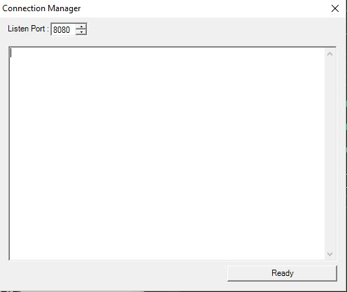

Reverse Port Forward
==================

Description
--------------------
C# based port forward using reverse socket connection and winform panel to to show connections status

Prerequisites
-----------------
* To run CSPortListen.exe ( listen panel ) at least you need .Net Framework 4.0. 

* To run CSPORTForward.exe ( local network port forwareder ) at least you need .Net Framework 2.0.

* make.exe,mkdir.exe ( Cygwin or Mingw )


Features
---------
* Run on windows with installed .net framework 2 or more
* Winform panel to show connection states and define listen ports 
* Reverse socket connection 

Compile 
-------

* Download nuget and install Microsoft.Net.Compilers using folowing command : 
```
nuget.exe install Microsoft.Net.Compilers
```
* Put Microsoft.Net.Compilers.x.x.x folder in src path 
* Run make in ```src\CSPortListen``` and ```src\CSPortForward``` paths
* .exe file will be in ```src\CSPortListen\debug``` and ```src\CSPortForward\debug``` paths 
* enjoy! ;) 

Usage
------

*  First you need to run CSPortListen program to listen connection. In ```Listen Port``` box (see below figure) you can find listend port number ( change if you need ) and press Ready/Start button to start listen (default port is 8080). 

<p align="center">
  
</p>


* run CSPORTForward project with folowing options : 
```
CSPortforward.exe <remote address> <report port> <local network address> <local network port> 
```
for example to access RDP port in local network with default port run : 
```
CSPortforward.exe 192.168.x.x 8080 127.0.0.1 3389
```

License
-------
This project is licensed under the GNU GENERAL PUBLIC LICENSE - see the [LICENSE.md](LICENSE.md) file for details

