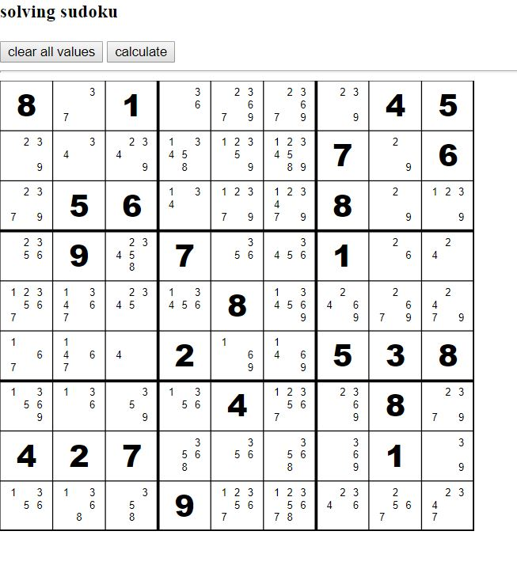

Sudoku Calculator
-------------------
js project to calculate all possible conditions in sudoku.

Description
--------------------
javascript project to generate all possible numbers in sudoku's blank space.

Usage
------

<p align="center">
  
</p>

* Before use run ```node express.js``` 
* Go to your browser and type ```localhost:3000```

License
-------
This project is licensed under the GNU GENERAL PUBLIC LICENSE - see the [LICENSE.md](LICENSE.md) file for details

