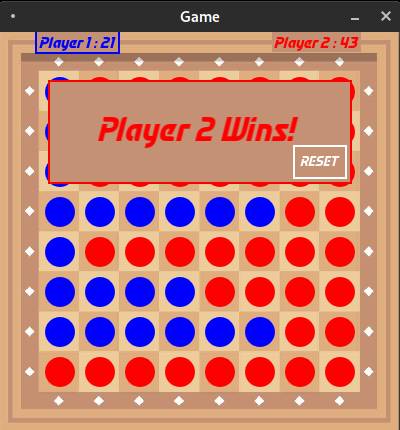

 # Board Game Using SFML and C++ (Simple Checkers)
This game is a simple two-player checkers game. Please note that read the assets licenses before starting the compilation and use of it. This game has been developed using the SFML library in C++. I have developed & tested this source code in Debian.



# Requirements

Before running the source code make sure that the SFML library is installed. You also need to install the CMake on your system to compile the source code. You need to install  C++ version 11 in your system to compile at least.

# Build


To build this project run the following command on Linux or Mac:
```
$ mkdir build
$ cd build
$ cmake ..
```

# Run
to run the project run the following command in the terminal:
```
$ make
```
